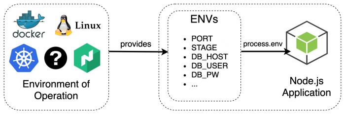

# Express.js environment variable

Environment variables are those variables that exist within the environment your code is running in. It could be your Windows / Mac / Linux environment on your local computer or the Heroku environment, Docker environment etc. This can be accessed by any program running in the environment.

We often use environment variables to store configuration information.
Configuration changes across different environments (such as local/QA environment, staging, production) and we will like to have a easy way to change the configuration without actually changing the code. We will not have to re-deploy the code just to change the configuration.



(image source: https://blog.codecentric.de/en/2019/05/webapps-node-express-typescript-part2/)

In Node.js, we use the global object `process.env` to access environment variables

For example, we often need a `PORT` environment variable to store the port number that our Express.js server will listen to.

```js
const PORT = process.env.PORT || 3000;
```

`3000` is the fallback value here. If there are environments (e.g. during local development) in which the environment variables are not set, we should set a fallback value that the variable will default to.

We then use the variable like a normal one.

```js
const server = app.listen(PORT, () => {
  console.log(`Server running at http://localhost:${PORT}`);
});
```
