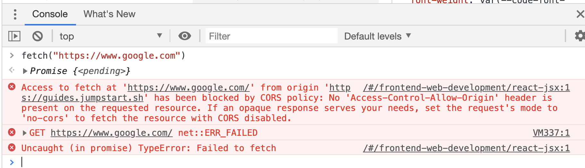

# Express.js path to production

## Useful packages

### Set NODE_ENV to development or production

Use the `cross-env` package.

### Load environment variables

Use the `dotenv` package.

### Security

- Json Web Token (JWT) or session id?
- Use cookies or local storage to store the JWT on the front-end?
- Are the passwords hashed?
- Is there cross-origin resource sharing (CORS) set up properly?

## Check your package.json

```json
"scripts": {
    "start": "cross-env NODE_ENV=production node index.js",
    "start:dev": "cross-env NODE_ENV=development nodemon index.js",
    "start:db": "mongod --dbpath ~/data/db",
    "test": "jest",
    "test:watch": "jest --watch"
  },
```

## CORS

If you deploy your frontend and backend as two separate applications on Heroku, you also need to enable CORS (Cross Origin Resource Sharing) between the two applications.

For example, assume your frontend and backend are deployed to the following two URLs:
https://my-backend-api.heroku.com
https://my-react-app.heroku.com

Your users would visit "https://my-react-app.heroku.com" to download the frontend React app into their browser, and then the JavaScript in your React app needs to make calls to your backend API, which is "https://my-backend-api.heroku.com". This is NOT allowed by the browsers by default, due to Same Origin Policy.
The walk around is to enable CORS in your backend API.

If you don’t set up a proper CORS policy on the **backend server** that allows it to respond to your approved 3rd party origins (for example, your own frontend server), the request will fail. The error will look something like this:



If you build the API using Express, you can configure the Express CORS middleware to allow the API to be called by another React application loaded from Heroku.

### Enabling CORS in Express.js

Install the `cors` package.

```
npm install cors
```

For example, here is a sample code for app.js in Express (assuming that your frontend localhost is on port 3001). For Heroku (or any hosting), set the environment variable `FRONTEND_URL` on Heroku itself. For running it locally, you could use your local `.env` file to set the `FRONTEND_URL` locally.

The value of the environment variable `FRONTEND_URL` could be your Netlify or Heroku frontend URL.

```js
const express = require("express");
const cors = require("cors");

var corsOptions = {
  origin: process.env.FRONTEND_URL || "http://localhost:3001",
};

const app = express();
app.use(cors(corsOptions));
```

We need `credentials: true` with the CORS package for accepting requests with cookies. It will make the response include the **Access-Control-Allow-Credentials** header and set it to `true`.

Note that origin cannot be the wildcard `*` if credentials is true.

> Cannot use wildcard in **Access-Control-Allow-Origin** when credentials flag is true

```js
const express = require("express");
const cors = require("cors");

var corsOptions = {
  origin: process.env.FRONTEND_URL || "http://localhost:3001",
  credentials: true,
};

const app = express();
app.use(cors(corsOptions));
```

If you would like to have multiple origins, you can also use an array.

```js
const corsOptions = {
  origin: [process.env.FRONTEND_ONE_URL, process.env.FRONTEND_TWO_URL],
  credentials: true,
};
```

Make sure your URL does not have a slash at the back.

To allow calls from any port for localhost and any application on Heroku:

```js
origin: [/http:\/\/localhost:.*/, /http[s]*:\/\/.*\.herokuapp.com/],
```

### Without npm package

Without using the npm package `cors`, you will have to add the headers to the response manually to enable CORS.

The following code is taken from [enable-cors.org](enable-cors.org).

```js
app.use(function(req, res, next) {
  res.header("Access-Control-Allow-Origin", "*");
  res.header(
    "Access-Control-Allow-Headers",
    "Origin, X-Requested-With, Content-Type, Accept"
  );
  next();
});
```
