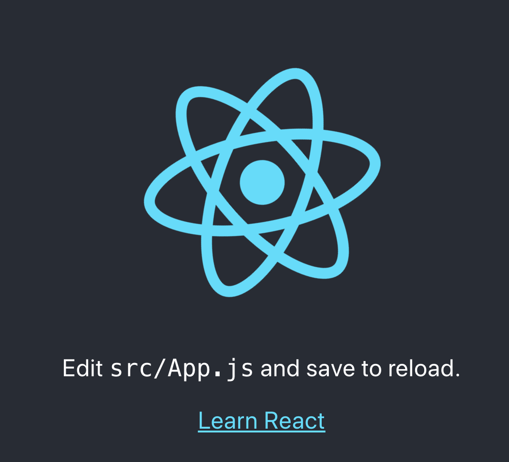
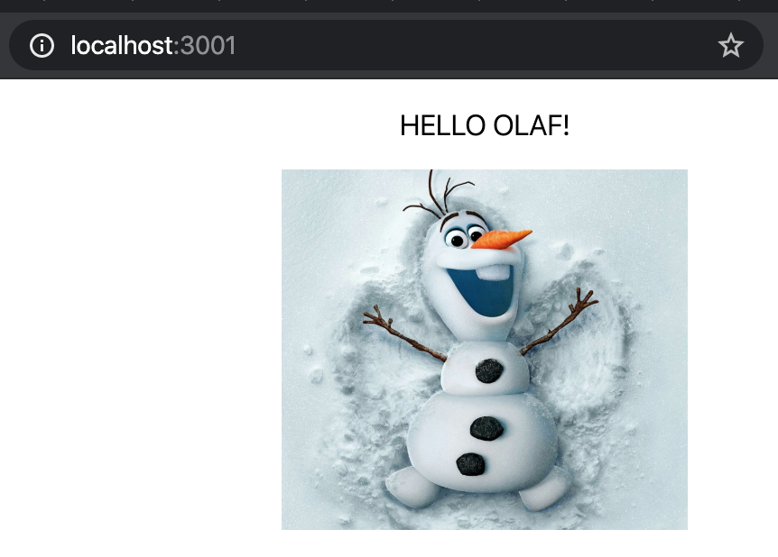

# Hello World with React

## Covers

1. Creating a react app with create-react-app
2. Understanding what was created

## Creating a hello-world with create-react-app

### creating the project folder

In bash, when type create-react-app with the application name, a folder will be created for us.

```sh
  npx create-react-app hello-world
```

verify this by type the "ls" command and you should see the folder listed out

```sh
ls
```

We can go into the folder by using cd command

```sh
cd hello-world
```

We can then install out dependencies

```sh
npm install
```

we can then start the app

```sh
npm run start
```

You should see the following image startup in your default browser.



### Cleaning Up

1. Replace the header tag with a paragraph tag and type "Hello World!".
2. Remove all styles in the App.css other than .App

App.js

```javascript
import React from "react";
import "./App.css";

function App() {
  return (
    <div className="App">
      <p>Hello World!</p>
    </div>
  );
}

export default App;
```

App.css

```css
.App {
  text-align: center;
}
```

## Exercise

1. Create a new react app and print out "Hello \<your favourite character name\>"
2. Add the image of your favourite character.
   

- tips
  - add the image into the public folder
  - use img tag
  - access the image with `src={process.env.PUBLIC_URL + "/<image name>.jpg"}`
