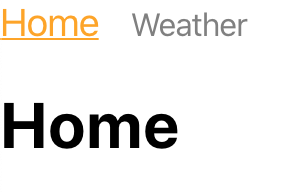
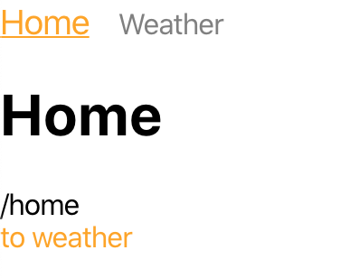
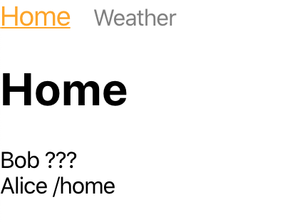

# React Router

managing multiple views in a React app

## Covers

1. Why we want to use it
2. Setup
3. Conditional rendering based on path
4. Navigating Pages
5. Accessing Router information within component.
6. Query params

## Why we want to use it

When our application grows, is common to have too much contents to make sense within a page.

One possible solution is to seperate the contents into different workflows or different Views.

Having a Router within the application allows users to reach out to the different views while staying within our application. React Router is a handy JS library that allow us to easily achieve this functionality.

Say our application have

- /home
- /photo-gallery
- /weather

When a user hit the url `/weather` in a browser, the react app with react router will load our react application, look at the url, checks the mapping of what to render and then renders only the `todo-list` portion of the code.

We will also want to show some links for user to have easy access to different part of our application.

## Setup

The package we are going to use is react-router.

```sh
npm install react-router-dom
```

https://reacttraining.com/react-router/web/guides/quick-start

```javascript
import React from "react";
import { BrowserRouter } from "react-router-dom"; // 1. import BrowserRouter

function App() {
  return (
    <BrowserRouter>
      {/* Wrap the contents of App with Browser Router*/}
      <div>Hello World!</div>
    </BrowserRouter>
  );
}

export default App;
```

## Conditional rendering based on path

### Rendering JSX directly

`Route` component helps to decide if a component should render.

First we can import a Route

```javascript
import { BrowserRouter, Route } from "react-router-dom";
```

then we can add 2 Routes, `/home` and `weather`. For now we just going to render the title of the page

```javascript
<BrowserRouter
  getUserConfirmation={(message, callback) => {
    const allowTransition = window.confirm(message);
    callback(allowTransition);
  }}
>
  <div>Hello World!</div>
  <Route path="/home" render={() => <h1>Home</h1>} />
  <Route path="/weather" render={() => <h1>Weather</h1>} />
</BrowserRouter>
```

Try hitting url `<path to react app>/home` (i.e. http://localhost:3000/home)
You should be able to see the "Home" printed below the hello world.

Now try to hit the url to weather.
You will see "Weather" being printed insteaad of "Home".

The behavior of route is very simple.

1. Look at our current URL
2. Checks if path of url **begins with** the path provided
3. render if matches, else do nothing

the checking logic can seems a little weird at the beginning.
Say `<Route path="/home" render={() => <h1>Home</h1>} />`

- http://<host>/home is a match
- http://<host>/hom is **NOT** a match
- http://<host>/homealone is **NOT** a match
- http://<host>/home-alone is **NOT** a match
- http://<host>/home/dinosaur a match

if we do not want `home/dinosaur` to be a match, we can add `exact` property
`<Route path="/home" exact render={() => <h1>Home</h1>} />`

### Rendering Components with Route

1. Move Home and Weather into Container folder.
2. Import Home and Wether in App.js
3. Replace `render` with `component` and pass in the Component

src/containers/Home

```javascript
import React from "react";

export default () => <h1>Home</h1>;
```

src/containers/Weather

```javascript
import React from "react";

export default () => <h1>Weather</h1>;
```

src/App

```javascript
// ...
import Home from "./containers/Home";
import Weather from "./containers/Weather"

// ...
<Route path="/home" component={Home} />
<Route path="/weather" component={Weather} />
// ...
```

Everything should works the same as before.

### Rendering only one component with Switch

As long as a path is match, Route will render the component.

```javascript
<Route path="/home/admin" render={() => <div>Admin</div>} />
<Route path="/home" render={() => <div>User</div>} />
```

when we hit the path `<host>/home/admin`, but "Admin" and "User" will be printed out
to fix this, we can add the Switch.

Sometimes we only want one match component to be rendered.
React router allow us to do so with the `<Switch>` component.

```javascript
import { BrowserRouter, Route, Switch } from "react-router-dom";
```

```javascript
<Switch>
  <Route path="/home/admin" render={() => <div>Admin</div>} />
  <Route path="/home" render={() => <div>User</div>} />
</Switch>
```

Hit `<host>/home/admin` again, now only "Admin" will be printed out.

### Guarding with default page

Using `Switch`, we can prepare a "Page not found" component and render out when no path are match.

```javascript
<Switch>
  <Route path="/home/admin" render={() => <div>Admin</div>} />
  <Route path="/home" render={() => <div>User</div>} />
  <Route path="/" render={() => <div>Page Not Found</div>}>
</Switch>
```

Ending the swich with a Route with path `/` will always be hit.

If we want the user be redirect to a specific page, we can use a `Redirect`

```javascript
//...
import { BrowserRouter, Route, Switch, Redirect } from "react-router-dom";

//...
<Switch>
  <Route path="/home/admin" render={() => <div>Admin</div>} />
  <Route path="/home" render={() => <div>User</div>} />
  <Route path="/404" render={() => <div>page Not Found</div>} />
  <Redirect to="/404" />
</Switch>;
```

## Navigating Page

We have learnt to setup Routes to do conditional rendering

### Wrong way using anchor tag or windows.

Using anchor tag or window.location.href will cause the browser to reload the whole React app breaking the Single Page Application experience.

```javascript
<BrowserRouter>
  <div>
    <a href="/home">Home</a>
  </div>
  <div>
    <a href="/" onClick={() => (window.location.href = "/weather")}>
      Weather
    </a>
  </div>
  <Switch>
    <Route exact path="/home" component={Home} />
    <Route exact path="/weather" component={Weather} />
    <Route path="/404" render={() => <div>page Not Found</div>} />
    <Redirect to="/404" />
  </Switch>
</BrowserRouter>
```

### Using Link

```javascript
// ...
import { BrowserRouter, Route, Switch, Redirect, Link } from "react-router-dom";

//...
<BrowserRouter>
  <div>
    <Link to="/home">Home</Link>
  </div>
  <div>
    <Link to="/weather">Weather</Link>
  </div>
  <Switch>
    <Route exact path="/home" component={Home} />
    <Route exact path="/weather" component={Weather} />
    <Route path="/404" render={() => <div>Page Not Found</div>} />
    <Redirect to="/404" />
  </Switch>
</BrowserRouter>;
```

Using Link, the React app no longer refreshes on load.

### Using Navlink to style active links

Say we want to tell the user where they are by showing the active links in a different color.
We can do that using `NavLink` instead of `Link`

`NavLink` works exactly same as `Link` but adds a "active" classname that allow us to style the active link differntly.

src/App.css

```css
header > a + a {
  margin-left: 1em;
}

a {
  color: gray;
  text-decoration: none;
}

a.active {
  color: orange;
  font-size: larger;
  text-decoration: underline;
}
```

src/App.js

```javascript
// ...
import { BrowserRouter, Route, Switch, NavLink } from "react-router-dom";

//...
<BrowserRouter>
  <header>
    <NavLink to="/home">Home</NavLink>
    <NavLink to="/weather">Weather</NavLink>
  </header>

  <Switch>
    <Route exact path="/home" component={Home} />
    <Route exact path="/weather" component={Weather} />
  </Switch>
</BrowserRouter>;
```

The `a.active` in `App.css` styles the active component. This is possible because of the add `active` class.

Is also possible to change the added classname with `activeClassName` or add inline styling `activeStyle`. In most cases you will not have to use them.



## Accessing Router information within component

React router provides you will 3 objects

1. history: allow you to navigate or goback to previous page
2. location: get the current path in the react app
3. match: information about the `Route` and query parameters that can be passed on

you can refer to the official document for the usage, in here we going to focus on how to access them.

### Components that render from route.

Components rendered from `Rotue` will have these 3 objects injected into the properties.

src/containers/Home.js

```javascript
import React from "react";

export default props => {
  return (
    <div>
      <h1>Home</h1>
      <div>{props.location.pathname}</div>
      <div
        style={{
          color: "orange",
          cursor: "pointer",
        }}
        onClick={() => props.history.push("/weather")}
      >
        to weather
      </div>
    </div>
  );
};
```

1. we gain access to location object which consist of the pathname
2. on clicking the "to weather" link, it brings us to weather. Similarly there are functions like `goBack` in the `history` object that allow us to return to where we come from.

note: inline styling is not recommmended in general.



### Accessing router objects from child component

We can accessing `history`, `location` and `match` in the Child component by

1. passing from parent
2. using the withRouter higher order component

The second way is preferred to decouple router related information from the components.
In the example below, we try to print out the current pathname if we have access to the location object, if not, we will print "???".

In our Home component, we render a component wrapped with `withRouter` and another without.
The same component wrapped within the `withRouter` gain access to the location object and print out the current path as expected.

src/containers/Home.js

```javascript
import React from "react";
import { withRouter } from "react-router-dom";

const UserName = props => {
  return (
    <div>
      {props.name} {props.location ? props.location.pathname : "???"}
    </div>
  );
};

const UserNameWRouter = withRouter(UserName);

export default props => {
  return (
    <div>
      <h1>Home</h1>
      <UserName name="Elsa" />
      <UserNameWRouter name="Alice" />
    </div>
  );
};
```



## Query params

Query params are helpful when comes to select specific information to render or to filter down items from a list.

For example if we have a menu of items. Each food item is mapped to a specific id.
We can fetch item based on the query params.

src/containers/Food.js

```javascript
import React from "react";
import { withRouter } from "react-router-dom";

const menu = {
  1: "chicken rice",
  2: "laksa",
  3: "durian",
};

const Food = props => {
  const foodId = props.match.params.id;
  const foodName = menu[foodId] || "something not in the menu";
  return (
    <div>
      <span>you have selected: </span>
      <b>{foodName}</b>
    </div>
  );
};

export default withRouter(Food);
```

src/App.js

```javascript
<Route path="/food/:id" component={Food} />
```

try accessing `/food/2`
"you have selected: laksa" will be displayed

## Exercise

1. https://github.com/thoughtworks-jumpstart/react-router-lab
