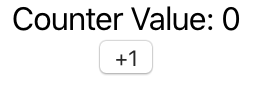
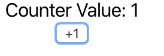
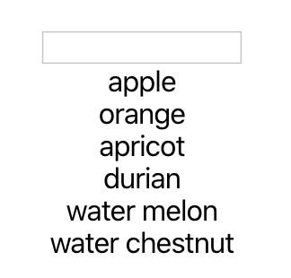
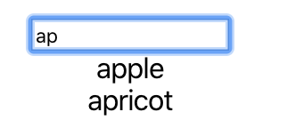
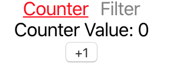
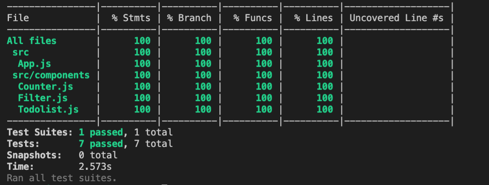

# React Testing Library

## Covers

1. Overview
2. Installation
3. Running test
4. Triggering click events
5. Enter text into an input box
6. Testing if the component exists with `data-testid`
7. Testing API
8. What to test for
9. F.I.R.S.T principle
10. Test Coverage

## Overview

- From: https://testing-library.com/docs/react-testing-library/intro
- Intro Video: https://youtu.be/JKOwJUM4_RM

### The problem

- Avoid including implementation details
- Maintainable in the long run
  - Changing of internal implementations that output the same system should not cause a test to fail.

### The solution

- React Testing Library
  - very light-weight solution for testing React components.
  - tests that works with actual DOM nodes
  - provides facilitate querying the DOM in the same way the user would

## Installation

As of create-react-app 3.3.0 (2019-12-04), you do not have to do the following steps. `create-react-app` installs the required package for you.

```sh
npm install --save-dev @testing-library/react @testing-library/jest-dom
```

Import `jest-dom` at the beginning for test file

```
import '@testing-library/jest-dom/extend-expect';
```

## Running test

src/App.js

```javascript
function App() {
  return <div className="App">Hello World</div>;
}
```

src/App.test.js

```javascript
import React from "react";
import { render } from "@testing-library/react";
import App from "./App";

test("renders learn react link", () => {
  const { getByText } = render(<App />);
  const linkElement = getByText(/Hello World/);
  expect(linkElement).toBeInTheDocument();
});
```

`@testing-library/react"` provides us with API that helps us to interact and get information from out component.
Available api: https://testing-library.com/docs/preact-testing-library/api

The `render` functions render the component to a DOM and provide you with methods that let you interact with the DOM. In, `const { getByText } = render(<App />);`, the `getByText` function allow us to find the element with the matching text in the DOM.
Avaialble functions: https://testing-library.com/docs/react-testing-library/cheatsheet

`toBeInTheDocument` came from a library, `@testing-library/jest-dom`, that extends the available matches in `jest`. `toBeInTheDocument` checks if an element is inside the dom.
Available matchers: https://github.com/testing-library/jest-dom

## Triggering click events

In most cases, the things we want to test haven't appeared on the screen yet. We will have to interact with the DOM and trigger the actual interaction to get results we want to show.

Say we have a counter.

```javascript
class App extends React.Component {
  constructor(props) {
    super(props);
    this.state = {
      counter: 0,
    };
  }

  render() {
    return (
      <div className="App">
        <div>Counter Value: {this.state.counter}</div>
        <button
          onClick={() =>
            this.setState({
              counter: this.state.counter + 1,
            })
          }
        >
          +1
        </button>
      </div>
    );
  }
}
```



clicking on the +1 button increases the counter value



```javascript
describe("+1 button", () => {
  it("should increase the counter value by 1", () => {
    const { getByText } = render(<App />);
    const addOneButton = getByText("+1");
    fireEvent.click(addOneButton);
    expect(() => getByText("Counter Value: 0")).toThrowError();
    expect(getByText("Counter Value: 1")).toBeInTheDocument();
  });
});
```

## Testing for input events

You are going to see text input fields a lot in projects. Let's take a look at how to work with them.

Say we have some data:

```javascript
["apple", "orange", "apricot", "durian", "water melon", "water chestnut"];
```

We want to display all the items. When I add text into an inbox box, we want to see only the data that contain the specific strings.



```javascript
<input aria-label="filter-text" onChange={this.updateFilterText} />;
{
  this.state.data
    .filter((text) => text.indexOf(this.state.filterText) >= 0)
    .map((data) => <div key={data}>{data}</div>);
}
```



```javascript
describe("Filter", () => {
  it("should only show filtered data that contains input string", () => {
    const { getByText, getByLabelText } = render(<App />);
    const dataFilterTextInput = getByLabelText("filter-text");
    fireEvent.change(dataFilterTextInput, {
      target: { value: "ap" },
    });

    expect(getByText("apple")).toBeInTheDocument();
    expect(getByText("apricot")).toBeInTheDocument();
    expect(() => getByText("orange")).toThrowError();
  });
});
```

We can find the text using `getByLabelText` because we added an aria-label in our input.
We then use `fireEvent` to simulate typing of "ap".
We can now `expect` to only find text that contains "ap".

# Testing if the component exists with`data-testid`.

Sometimes, we just want to test if a component exists. We can use the internal implementation of the component to another test file.

One example is testing of navigating between Views. We do not care about the content of the View or the functionality.

App.js

```javascript
<BrowserRouter>
  <NavLink
    activeStyle={{ color: "red", textDecoration: "underline" }}
    style={{ color: "gray" }}
    to="/counter"
  >
    Counter
  </NavLink>
  <NavLink
    activeStyle={{ color: "red", textDecoration: "underline" }}
    style={{ marginLeft: 10, color: "gray", textDecoration: "none" }}
    to="/filter"
  >
    Filter
  </NavLink>
  <Route path="/counter" component={Counter} />
  <Route path="/filter" component={Filter} />
</BrowserRouter>
```



We can add `data-testid` on the counter and filter component.

Filter component

```javascript
class Filter extends React.Component {
  render() {
    <div data-testid="filter">...</div>;
  }
}
```

Counter component

```javascript
class Counter extends React.Component {
  render() {
    <div data-testid="counter">...</div>;
  }
}
```

In our Test file

```javascript
describe("NavLink", () => {
  it("should render Filter component when click on filter link", () => {
    const { getByText, getByTestId } = render(<App />);
    const filterLink = getByText("Filter");

    fireEvent.click(filterLink);
    expect(getByTestId("filter")).toBeInTheDocument();
  });

  it("should render Counter component when click on filter link", () => {
    const { getByText, getByTestId } = render(<App />);
    const filterLink = getByText("Counter");

    fireEvent.click(filterLink);
    expect(getByTestId("counter")).toBeInTheDocument();
  });
});
```

## Testing API

Is common for react app to be interacting with web server outside of the app. Testing this interaction is good, but we want to limit it to the bare minimum, this is due to cost and stability.
We usually do this on a separate End to End test.

So we want to mock our API.
We can use another package to help use.

```sh
npm install --save-dev axios-mock-adapter
```

```javascript
export class Todolist extends React.Component {
  constructor(props) {
    super(props);

    this.state = {
      todos: [],
    };
  }

  componentDidMount() {
    axios("https://jsonplaceholder.typicode.com/todos").then((res) => {
      this.setState({ todos: res.data });
    });
  }

  render() {
    return (
      <div>
        {this.state.todos.map((todo) => (
          <div key={todo.id}>{todo.title}</div>
        ))}
      </div>
    );
  }
}
```

Test

```javascript
// ...
import axios from "axios";
import MockAdapter from "axios-mock-adapter";
const mockAxios = new MockAdapter(axios);

describe("Todolist", () => {
  const userData = [
    {
      userId: 1,
      id: 1,
      title: "delectus aut autem",
      completed: false,
    },
    {
      userId: 1,
      id: 2,
      title: "quis ut nam facilis et officia qui",
      completed: false,
    },
  ];

  beforeEach(() => {
    mockAxios.reset();
  });

  it("should render todo title", async () => {
    mockAxios
      .onGet("https://jsonplaceholder.typicode.com/todos")
      .reply(200, userData);

    const { getByText } = render(<Todolist />);

    await waitForElement(() => getByText("delectus aut autem"));
    expect(getByText("delectus aut autem")).toBeInTheDocument();
  });
});
```

## What to test for

1. Test for components that are rendered
2. Test for events and user interactions
3. Test for state change

- by interactions
- UI change caused by incoming data

4. Test for the correctness of payload to be sent out
5. Test for corner/edge cases
6. Test for possible regression

## F.I.R.S.T principle

1. Fast: whole test suite should take seconds
2. Independent: test should pass when run independently or as a suite
3. Repeatable: the test is going to give the same result no matter how many times I run it
4. Self Checking: result in a pass or fail. Expect statement should have a clear intent.
5. Timely, written same time same as the code ideally using TDD

## Test Coverage

```sh
npx react-scripts test --coverage --watchAll=false
```

Ignoring files without code written by you.
package.json

```javascript
"scripts": {
  "start": "react-scripts start",
  "build": "react-scripts build",
  "test": "react-scripts test",
  "eject": "react-scripts eject",
  "coverage": "react-scripts test --coverage --watchAll=false"
},
"jest": {
  "coveragePathIgnorePatterns": [
    "./src/serviceWorker.js",
    "./src/index.js"
  ]
}
```



## Exercise

Implement test using React Testing Library to

1. Pokemon lab(functional component)
2. FizzBuzz lab(class component)
3. [Optional] Todolist code along
