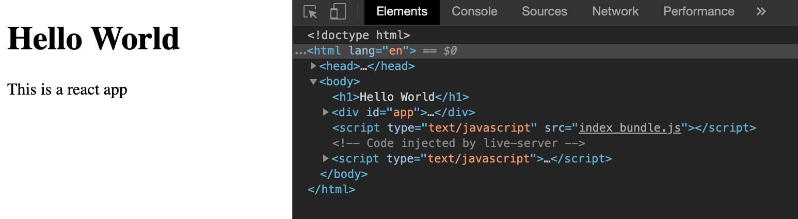

# Webpack and Babel

`create react app` uses Webpack and babel to create a straightforward setup for users.
While it might not help you on your day to day work as a react developer, It is beneficial to have a glimpse of how the magic happens.

## Covers

1. What is Webpack
2. Simple demo on Webpack
3. What is Babel
4. Very Simple React App from scratch

## What is Webpack

Webpack is a module bundler. In simple, it just does 3 things.

1. look for files based on given conditions
2. do something to the files using a loader, typically to bundle multiple files into one file
3. put the result somewhere (i.e. dist/main.js)

For a long explanation, you can refer to the [official documentation](https://webpack.js.org/concepts/)

## Simple demo on Webpack

1. create a new folder: `mkdir webpack-demo`
2. create an `index.html` file

```html
<!DOCTYPE html>
<html lang="en">
  <head>
    <title>Webpack Demo</title>
  </head>
  <body>
    <div id="container"></div>
    <script src="dist/bundle.js"></script>
  </body>
</html>
```

3. install Webpack

```sh
npm init -y
npm install webpack webpack-cli
npm install moment
```

4. create an `index.js` file in the `src` folder

```javascript
import moment from "moment";

const container = document.getElementById("container");
container.appendChild(document.createTextNode(moment()));
```

5. Create a Webpack config file `webpack.config.js`

```javascript
module.exports = {
  entry: "./src/index.js",
  output: {
    filename: "bundle.js",
  },
};
```

6. Add run Webpack script in package.json

```javascript
  "scripts": {
    "webpack:dev": "webpack --mode development --watch"
  },
```

7. Run the build script `npm run webpack:dev`, a file is created for you `dist/bundle.js`

8. View index.html on a browser or run in live server. The time should show correctly.

Webpack have successfully bundle `moment.js` with `index.js` to a single file `bundle.js`

## What is Babel

Babel is a JS compiler. You can also think of it as a translator typically translating a syntax that a newer browser can understand to a format that everyone else can also understand them.

Browser doesn't understand JSX, so we will need the help of Babel to translate JSX to something browser can understand.

Try it out here: https://babeljs.io/repl

In JSX

```javascript
function SayHello({ name }) {
  return <div style={{ color: red }}>Hello {name}</div>;
}
```

after compiling using babel

```javascript
"use strict";

function SayHello(_ref) {
  var name = _ref.name;
  return React.createElement(
    "div",
    {
      style: {
        color: red,
      },
    },
    "Hello ",
    name,
  );
}
```

## Very Simple React App from scratch

### Starting a new project

We are going to start by creating a folder and create a package.json file.

```sh
  mkdir my-react-app
  cd my-react-app
  npm init -y
```

### Setup webpack to compile HTML and JS

Here we are going to install Webpack and `html-webpack-plugin` to compile and bundle our HTML and JS files.

```sh
npm i -D webpack webpack-cli html-webpack-plugin
```

Create a template HTML file.
[Emmet](https://docs.emmet.io/) can create a template for us.
We could easily create the same thing ourselves.
The only line added bellow was `<h1>Hello World</h1>`.

src/index.html

```html
<!DOCTYPE html>
<html lang="en">
  <head>
    <meta charset="UTF-8" />
    <meta name="viewport" content="width=device-width, initial-scale=1.0" />
    <meta http-equiv="X-UA-Compatible" content="ie=edge" />
    <title>Document</title>
  </head>
  <body>
    <h1>Hello World</h1>
  </body>
</html>
```

We can then create a simple js file.

In src/index.js

```
console.log("hello to javascript land");
```

Then we need to create a webpack.config.json to tell Webpack what are the input and output file
Files and node modules imported from the `entry` is bundled up for you into the stated file name `index_bundle.js` inside the `dist`.

```javascript
var HtmlWebpackPlugin = require("html-webpack-plugin");
var path = require("path");

module.exports = {
  entry: "./src/index.js",
  output: {
    path: path.resolve(__dirname, "./dist"),
    filename: "index_bundle.js",
  },
  plugins: [
    new HtmlWebpackPlugin({
      template: "./src/index.html",
    }),
  ],
};
```

Adding build script into package.json

```
"scripts": {
  "webpack:dev": "webpack --mode development"
}
```

After running `npm run webpack:dev`, webpack is going to create 2 files for us.

- dist/index.html
- dist/index_bundle.js

`dist/index_bundle.js` contains all our javascript code.

In `dist/index.html` a script tag is added for us, this script tag imports the index_bundle.js.

dist/index.html

```html
<body>
  <h1>Hello World</h1>
  <div id="app"></div>
  <script type="text/javascript" src="index_bundle.js"></script>
</body>
```

Open `dist/index.html` in a browser, and you can see the `Hello World` printed.
Open the developer tool and refresh, you should see the `console.log` message printed.

### Adding React and Babel

We want to code in react and JSX, but the browser doesn't understand JSX.
We are going to use Babel in Webpack to compile the code from JSX to regular javascript so the browser can understand what we wrote.

Let's add some react code.

Install react and react-dom which is required for React to work

```sh
npm install --save react react-dom # or simply npm i react react-dom
```

src/index.js

```javascript
import React from "react";
import ReactDOM from "react-dom";

import App from "./App.jsx";

ReactDOM.render(<App />, document.getElementById("app"));
```

Realise that we need to import App as `App.jsx`.
In our regular create react app, there is another Webpack plugin that can help you omit the `.jsx`. Since we want the most simple setup, we are going to skip this part.

src/App.js

```javascript
import React from "react";

export default () => <p>This is a react app</p>;
```

We going to print out a single line, `This is a react app`. If Webpack and babel help us compile successfully, we should see this when opening up the HTML file.

Installing babel dependencies

```sh
npm i -D @babel/core @babel/preset-env @babel/preset-react babel-loader
```

Observe the package `@babel/preset-react`. You can probably guess that if you are using `Angular` or `Vue`, we can use babel to do the same compilation by changing the package.

Configure babel in `.babelrc`

```javascript
{
  "presets": ["@babel/preset-react"]
}

```

Let Webpack know about babel and use babel-loader to translate the react code into regular javascript before output into `dist/index_bundle.js`.

webpack.config.js

```js
var HtmlWebpackPlugin = require("html-webpack-plugin");
var path = require("path");

module.exports = {
  module: {
    rules: [
      {
        test: /\.(js|jsx)$/,
        exclude: /node_modules/,
        use: {
          loader: "babel-loader",
        },
      },
    ],
  },
  entry: "./src/index.js",
  output: {
    path: path.resolve(__dirname, "./dist"),
    filename: "index_bundle.js",
  },
  plugins: [
    new HtmlWebpackPlugin({
      template: "./src/index.html",
    }),
  ],
};
```

In the Webpack configurations, we added a new module. Modules are small programs that do some functionality. The babel-loader we have that, in turn, using the `@babel/preset-react` to help us translate JSX to regular javascript.

`test` is a regular expression that finds all of the files that we want to apply the rule too. We can also `excludes` files and folder such as `node_modules`, and the `module` we are using is the `babel-loader`. There are other loaders such as `css-loader`..

Run `npm run webpack:dev` again.
Open `dist/index.html` in the browser, and you should now see `This is a react app` gets printed out.



The code can be found here: https://github.com/thoughtworks-jumpstart/Babel-React

### End note

In the demo above, we took a look at a straightforward setup to get a React app up and running.
We are using Webpack and `html-webpack-plugin` to compile all our javascript file into `dist/index_bundle.js` using our HTML file as a template.
We also look at using Babel to translate JSX to JS before compiling.

The actual Webpack configuration from create-react-app is highly sophisticated and intelligent. It compiles CSS, SASS, JSX and many other functionalities seamlessly to give the best possible developer experience.
