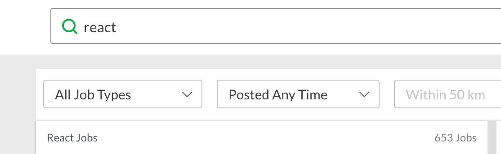
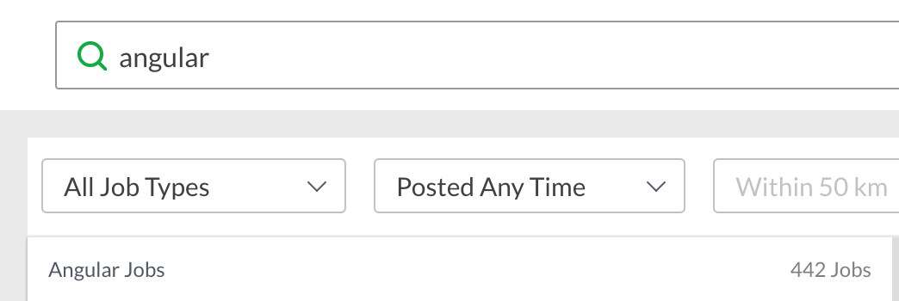
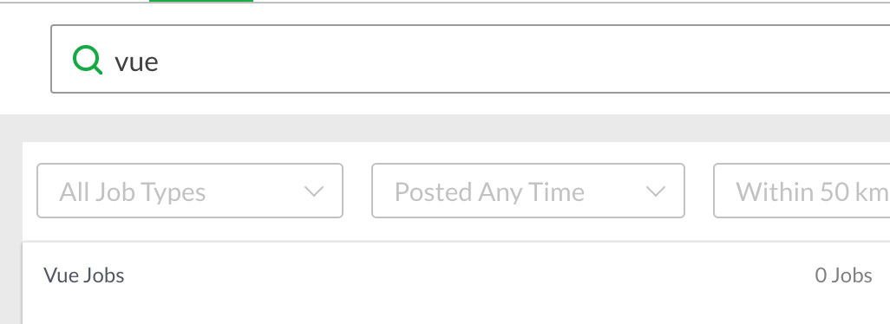
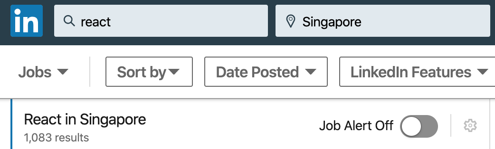

# Why React

A brief comparision of react vs other available options

## Covers

1. What is React
2. How is react differently from bootstrap or material UI
3. Why do we want to use a framework
4. Why React over Angular.js or Vue.js

## What is React

React is a javascript library build by Facebook to create UI components/user interface.

You don't have to use react or other JS library to create UI components but having a library helps you to structure your code in a way that components can easily be reused and much more maintainable.

## How is react different from bootstrap or material UI

Bootstrap, Material UI and such are UI component library. While it sounds the same, the difference is significant. A UI component library provides you with components ready for use. They are pre-build and already styled and have interaction functionality while a JS library like React can use to create custom components.

A JS library used to create UI components is often used together with UI component libraries to speed up requirements. But for web applications that require very customised design, it might be better to use without a UI component library. Developers will have to spend too much time trying to make UI components similar to the required design. Updating the UI component libraries might cause breakage in the system also.

If there is the flexibility to follow a UI component library, it will be best to use one. You will get the best of both worlds of being able to use a very well developer UI component library and use a JS library such as React to group components together to form Views.

## Why do we want to use a JS framework

Having a JS framework for creating components gives structure to your code and encourage reusability of components. The timing to triggering a re-render can be a challenging task without a library helping you to keep track of your data has changed.

- Give structure
- Encourage reusability
- Group closely related View and functionality together.
- Better developer tools such as React Developer Tool
  - check the inner state of components
  - profiling for performance
- Possibly faster rendering by grouping changes together in virtual DOM and update the DOM together

## Why React over Angular or Vue

### Is react better than Angular or Vue

- Short answer NO

### Job opportunity in Singapore As of 27 Dec 2019

- Glassdoor

  - react: 653
  - angular + angularjs(v1): 442
  - vue: 0

  
  
  

- LinkedIn Jobs

  - react: 1083
  - angular + angularjs(v1): 852
  - vue: 204

  
  
  

### Flexibility

- React motto, "learn once, write everywhere."

  - Desktop apps with React and Electron
  - Mobile apps thru React Native

- Popularity

  - Download trends: https://www.npmtrends.com/angular-vs-react-vs-vue

  

### Learning Curve

Angular learning curve tends to be very steep, requires you to know both javascript and typescript well and some harder concepts like Dependencies Injection. Once learned, you can easily build fast and powerful web apps quickly. ‌

React is not a complete solution and is often used with other libraries. React is often used with JSX, an HTML like syntax used. Many times React needs you to supplement it with excellent javascript skills to filter data and extract what you want yourself. With create-react-app, a lot of the problematic setup has been handled for you. ‌

Vue is very lightweight and relatively easy to learn. At the time of writing, Vue is transiting to v3. Is not as mature as Angular and React and is not backed by big companies such as Google and Facebook. It also allows you to structure your code in a flexible way which can lead to inadequate designs and hard to find bugs if you are not careful.

### Conclusion

Having a JS library like React helps with structuring code properly and encourage reusability. React is by far the most popular language and requires a complement of good javascript skills. You can build native apps with React too.
