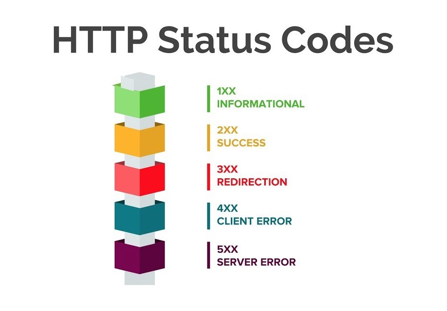
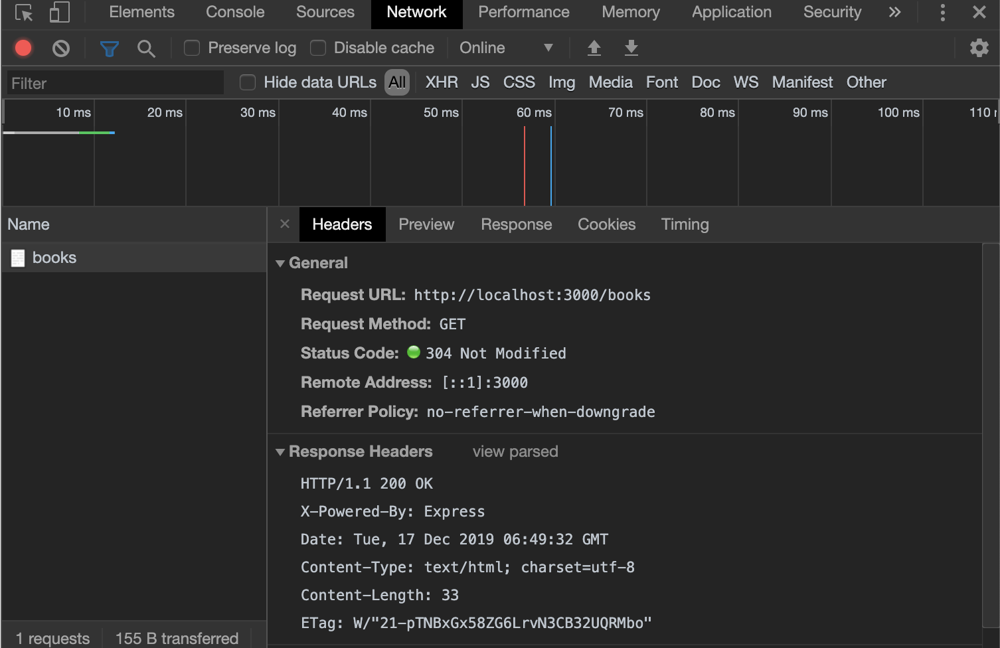

# HTTP

HTTP stands for HyperText Transfer Protocol. An HTTP client sends a request message to an HTTP server. The server, in turn, returns a response message.

See [this website](https://www.ntu.edu.sg/home/ehchua/programming/webprogramming/HTTP_Basics.html) for more diagrams.

## Request methods

HTTP protocol defines a set of request methods, these are the common ones that we regularly use:

- GET: A client can use the GET request to get a web resource from the server.
- POST: Create a new resource on the server
- PUT: Update a resource on the server
- DELETE: Delete a resource on the server

Resources could be a page, an image or even a video file.

## Browser

Whenever you type a URL in your favourite browser to get a web resource using HTTP, for example http://www.example.com, the browser turns the URL into a GET request message and sends it to the HTTP server. The HTTP server interprets the request message, and returns you an appropriate response message, which is either the resource you requested or an error message.

The browser can also send POST request messages if your website has a form.

## Uniform Resource Locator (URL)

URL (Uniform Resource Locator) is used to uniquely identify a resource over the web.

A URL might look like this:

```
protocol://hostname:port/path-and-file-name
```

| protocol | hostname   | port  | path   | querystring |
| -------- | ---------- | ----- | ------ | ----------- |
| http://  | localhost  | :3000 | /books | ?id=1       |
| https:// | google.com |       | /      |             |

### Protocol

Protocol is how the request will be transmitted. We usually deal with _http_ or _https_. Other common protocols include _file_ and _ftp_ that might even need a username and password in the URL.

### Host

Host is the name of the server. Your own computer will be called localhost. Another computer could be a numeric IP address and on the internet, the host name will look like example.com. There could be a _subdomain_ prefix to the hostname. _www_ is a very common subdomain.

### Port

Every server has numbered ports whereby communication can take place. Some ports are reserved, like 80 and 443. If you omit the port, 80 is assumed for HTTP and 443 is for HTTPS. For your own app API, you should generally use a port number [greater than 1023](https://en.wikipedia.org/wiki/List_of_TCP_and_UDP_port_numbers). 3000, 8080 and 8088 are commonly used port numbers as they are easy to remember.

### Path

Path is used to uniquely identify pages or other resources like images.

### Querystring

Querystring is an optional part of the URL that consists of name/value (key/value) pairs.
It will start with a question mark (?) and name/value pairs are separated by ampersands (&).

The format is: ?key1=value1&key2=value2

```
?id=1
?type=VEGETABLE
?color=red
?type=VEGETABLE&color=red
```

## HTTP messages

HTTP messages consist of:

- Request line or Status line
- Headers
- An empty line
- Optional HTTP message body data

### Request

Example of a GET request made when visiting www.example.com using a browser:

```
GET /index.html HTTP/1.1
Host: www.example.com
Accept: image/gif, image/jpeg, */*
Accept-Language: en-us
Accept-Encoding: gzip, deflate
User-Agent: Mozilla/4.0 (compatible; MSIE 6.0; Windows NT 5.1)
(blank line)
```

`GET /index.html HTTP/1.1` is called the _request line_.
`Host: www.example.com`, `User-Agent: Mozilla/4.0` are some of the _request headers_ that exist in the HTTP request. HTTP Headers are key-value pairs that are separated by a colon.

You can find a list of valid headers on [MDN’s HTTP Headers Reference](https://www.smashingmagazine.com/2018/01/understanding-using-rest-api/).

### Response

Example of the response:

```
HTTP/1.1 200 OK
Date: Sun, 18 Oct 2009 08:56:53 GMT
Server: Apache/2.2.14 (Win32)
Last-Modified: Sat, 20 Nov 2004 07:16:26 GMT
ETag: "10000000565a5-2c-3e94b66c2e680"
Accept-Ranges: bytes
Content-Length: 44
Connection: close
Content-Type: text/html
(blank line)
<html><body><h1>this is an example</h1></body></html>
```

`HTTP/1.1 200 OK` is called the _status line_. It consists of the HTTP version `1.1`, the status code `200` and the reason phrase `OK`. We will look into more status codes later.

`Content-Length: 44`, `Content-Type: text/html` are some of the _response headers_ in the HTTP response.

The lines after the blank line consist of the _body data_.

The browser will display the body of the response message according to the media type of the response (as in the `Content-Type` response header). Possible content types include "text/plain", "text/html", "image/gif", "image/jpeg", "audio/mpeg", "video/mpeg", "application/msword", and "application/pdf".

### Practical usage

#### Size limit on URL length

When using HTTP GET method, you typically need to send some query strings, for example
`GET /api/users?country=SG&age=M&hobby=football..`
You need to be aware that there is a size limit on the total length of the URL, which is somewhere between 2KB and 8KB. A question to ask is: [What is the maximum length of URL in the different browsers](https://stackoverflow.com/questions/417142/what-is-the-maximum-length-of-a-url-in-different-browsers)?

#### GET method with querystrings

If you are using the GET method, you are limited to a maximum of 2,048 characters, minus the number of characters in the actual path.

However, [the POST method is not limited by the size of the URL for querystrings](https://helpx.adobe.com/mt/experience-manager/scene7/kb/base/is_protocol-_-forming_is/url-character-limit-get-requests.html) because these are transferred in the header and not in the URL.

#### Can I use request body with HTTP GET method?

Since there is a size limit on the URL length of GET method, can I put the data into the request body? You can do that, but it's not a good idea. One of the reasons is the request body is not cached when browser (or the server side) caches a request. More discussion regarding this can be found [here](https://stackoverflow.com/questions/978061/http-get-with-request-body).

### Status codes



Source: [https://www.youtube.com/watch?v=LtNSd_4txVc](https://www.youtube.com/watch?v=LtNSd_4txVc)

#### Commonly used status codes

- 200 OK: The request is successful. The meaning of success depends on the request method. The response includes information.
- 201 Created: The request has been fulfilled, resulting in the creation of a new resource
- 204 No Content: The server successfully processed the request, but is not returning any content
- 301 Moved Permanently: The resource requested has permanently moved to the URL given by the Location headers. Browsers and search engines can be redirected. This could be important for SEO. This will also retain users and provide more information than 404.
- 400 Bad Request: The request could not be understood by the server due to malformed syntax
- 401 Unauthorized: The access is not authorized.
- 403 Forbidden: The access is forbidden and the response includes information on access denied.
- 404 Not Found
- 500 Internal Server Error: This describes a general server error. We often do not want to elaborate on the server error so as to prevent hackers.

### Tracking HTTP requests and responses

Using developer tools on a browser, we can track and view the HTTP requests made on a website.

For example, when we visit http://localhost:3000/books, we could use the Network developer tool to view the GET request made.


