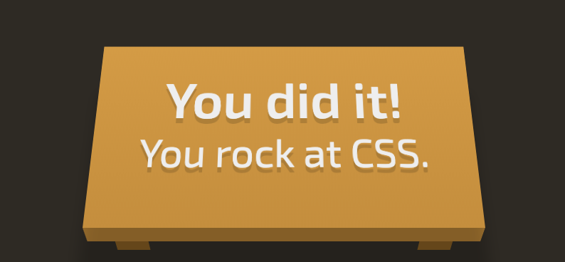

# Cascading Style Sheets

adding presentational styles to HTML

## Terminology

### Declaration block

A declaration block defines how to style matching elements. Declaration block consist of a selector(`p`) and multiple declarations(`color: red;`).

```css
p {
  color: red;
  text-align: center;
}
```

`p` is the selector, the `p` selector indicators that all paragraph elements will be affected by the style defined in the declarations.

`color: red` is a declaration which declares what style changes will be applied to the selected element

`color` is a property, specifies the property of the selected element. Different selectors have a fixed set of property that the stylesheet can specify. If the property does not exist, the declaration will be ignored.

`red` is a value. The value too, must be valid to the property.

## Comment

We can add comments in our stylesheet if there is anything we want to clarify to other developers.

We do not recommend using comments. Comments are necessary typically in 2 situation
very unique and doesn't make sense in a normal situation
we have written such lousy code that explanations are required for others to understand what we are trying to do.

```css
/* this is a comment */
p {
  color: red;
  text-align: center;
}
```

## Selectors

### Basic Selectors

You can also select by id or class name.
An id is specified with `#` in front of the id.
A class name is specified with a `.` in front of the class name.

```css
/* classname */
.header {
  text-transform: capitalize;
}

/* id */
#submit-button {
  background-color: blue;
}
```

For a more specific specifier, you can use more than one specifier and their connecting relationship.

```css
/* child */
ul li {
  color: red;
}

/* direct child */
ul > li {
  color: blue;
}

/* adjacent */
span + span {
  margin-left: 1em;
}

/* sibling */
span ~ span {
  margin-left: 1em;
}
```

### Multiple selectors

CSS allows multiple selectors to the same declaration by using a `,` as a separator

```css
.modal-text,
.button-text {
  color: pink;
}
```

## Inheritance

We know that HTML elements form a tree structure: one HTML element can have other HTML elements has children.
On some HTML element, if we don't define some CSS property (e.g. colour), and the same property has been defined in its parent. Would the element inherit the property from its parent?
The answer is not very straightforward.

### The inheritance rules only apply when there is no explicit value set for the property

If you already set a property for an HTML element explicitly, then the element does not need to inherit the property from its parent.

### Commonly used properties with inheritance behaviour

- border-spacing
- color
- cursor
- font-family
- font-size
- font-style
- font-variant
- font-weight
- font
- letter-spacing
- line-height
- list-style-image
- list-style-position
- list-style-type
- list-style
- text-align
- text-indent
- text-transform
- visibility
- white-space
- word-spacing

### Commonly used properties with **NO** inheritance behaviour

- border
- background
- float
- height
- top
- right
- bottom
- left
- position
- vertical-align
- width
- z-index

### Overwrite inherit behaviour

If the default inheritance rule does not work for you in a specific situation, you can explicitly specify that an element needs (or doesn't need) to inherit property from its ancestor.

For example, you can add a CSS rule on a div to force it inherits the border property from its parent.

```css
div {
  border: inherit;
}
```

- [revert](https://developer.mozilla.org/en-US/docs/Web/CSS/revert) - set the browser default style
- [inherit](https://developer.mozilla.org/en-US/docs/Web/CSS/inherit) - take style from immediate parent, set to revert on the rest of the case
- [initial](https://developer.mozilla.org/en-US/docs/Web/CSS/initial) - set to default style based on css specification
- [unset](https://developer.mozilla.org/en-US/docs/Web/CSS/unset) - inherit from immediate parent, set to initial on the rest of the case

Use this sparsely, or you may create lots of confusion for yourself your team.

### Specification rules

Aim for specifications that indicate the item you are choosing without being so strict that variations of the element cannot overwrite the style. In practice, we should avoid using `!important` and inline styling.

**Highest priority to lowerest**

- important `color: red !important;`
- inline styling `<p style="color: red;">inline is bad</p>`
- id `#submit-button`
- class `.button`
- element `p`

## Practice

https://flukeout.github.io/


