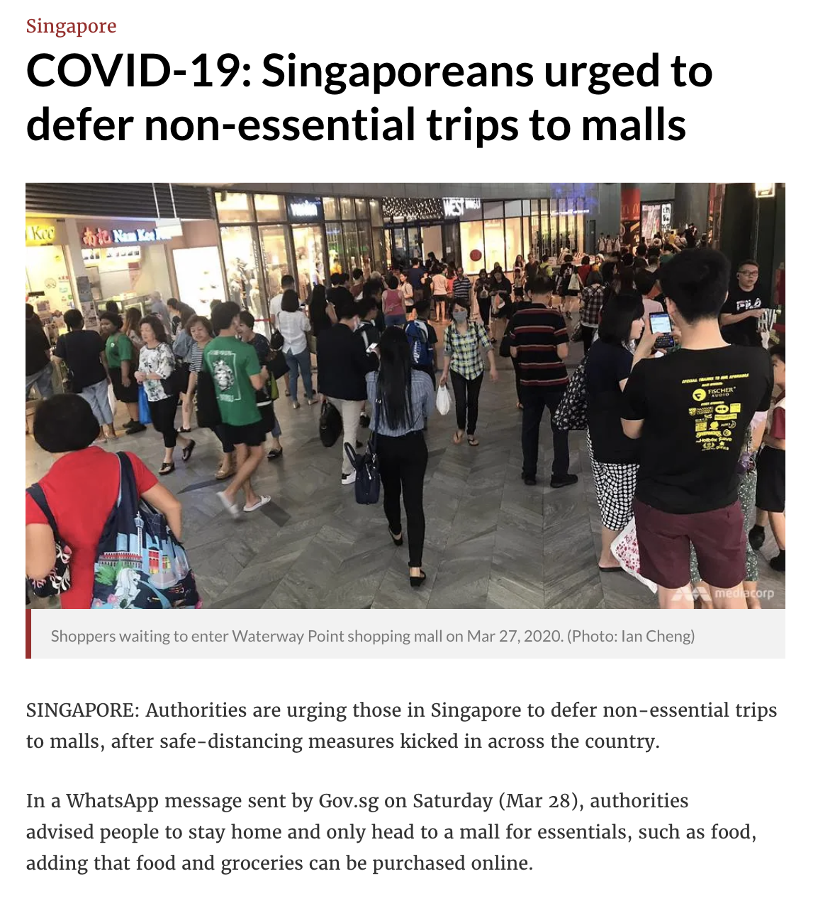

# HTML

HTML stands for HyperText Markup Language is the markup language to create web pages and is the main building block to display any content to users on web browsers.

HTML defines the structure of the code. Considering the HTML below taken from [CNA](https://www.channelnewsasia.com/news/singapore/covid-19-singapore-defer-non-essential-trips-malls-12585604) There is the main header(h1) follow by a paragraph of text which gives some form of structure which makes user relate the article relates to the heading and the picture. HTML uses tags such as `h1`, `span` and `p` to help identify the different resource to the user.



```html
<header class="article__header">
  <span class="article__category"> Singapore</span>
  <h1 class="article__title">
    COVID-19: Singaporeans urged to defer non-essential trips to malls
  </h1>

  <div class="c-picture--article-header"></div>
  <p>
    SINGAPORE: Authorities are urging those in Singapore to defer non-essential
    trips to malls, after safe-distancing measures kicked in across the country.
  </p>
  <p>
    In a WhatsApp message sent by Gov.sg on Saturday (Mar 28), authorities
    advised&nbsp;people to stay home and only head to a mall for essentials,
    such as food, adding that food and groceries can be purchased online.&nbsp;
  </p>
</header>
```

## Terminology

### Element

Elements using consist of an opening and close tag and represents some content or information to the browser.

With opening and closing tags:
`<p>apple</p>`

Self closing tags:
`<input type="text"/>`

### Tags

Tags are containers to hold information. Each tag will have a left angle bracket(`<`) and a right angle bracket(`>`). The brackets container some characters or words that represent the meaning; for example, a p tag represents a paragraph.

- opening tag: (`<p>`)

If the forward-slash `/` comes before the characters in the tag, it represents a closing tag.

- closing tag: (`</p>`)

A self-closing tag does not have to have a matching opening and closing tags, but the forward-slash will be located right before the closing right angle bracket.

- self closing tag: `<input type="text"/>`

### Attributes

Html element can have attributes that give additional information to the component.

```html
<p title="title of hello">hello</p>
<a href="www.google.com">google</a>
```

### Block elements

Block elements take the whole width of the page, and any new element will appear on a new line.

some common block elements

- div
- form
- p
- h1, h2, h3
- table
- ul, ol
- hr

### Inline element

An inline element will render beside each other.

some common inline element

- span
- stong, b
- emphasis, i
- code
- button
- image
- input

## Nested element

Elements can nest within each other to represent a parent and children relationship. For example, we can create an article with a title and text.

```html
<article>
  <h1>HTML</h1>
  <p>HTML stands for Hypertext Markup Language</p>
</article>
```

## Anatomy of an HTML

```
<!DOCTYPE html>
<html>
    <head>
        <title></title>
    </head>
    <body>
        <h1>Hello World</h1>
    </body>
</html>
```

### DOCTYPE

Must be the first thing to be declared in an HTML file. Tells you the version of HTML we are using. The tag above tells us that we are using HTML version 5.

### Head tag

The `head` tag display information about the page.

```html
<head>
  <meta charset="UTF-8" />
  <meta name="viewport" content="width=device-width, initial-scale=1.0" />
  <title>Document</title>
</head>
```

### Body tag

The `body` tag will render contents that the viewers will see.

```html
<body>
  <p>Welcome Developers</p>
</body>
```

### Comment

We can also add comments, code in our code that will not be acknowledged by the browser.

```html
<body>
  <h1>Hello World</h1>
  <!-- 
    <p>This will not be seen</p>
    <p>This will also not be seen</p>
  -->
</body>
```

### Emmet

Typing HTML can be tedious. Many developer tools support emmet, a toolkit that provides snippets to generate HTML tags.
The `!` is especially useful to give us a template to start creating HTML pages. Don't get too good at it! We won't be writing much HTML

see full Emmet cheat sheet here: https://docs.emmet.io/cheat-sheet/

```
! ➜
.blah ➜
#blah ➜
.blah*10 ➜
.blah.foo#bar ➜
```

### Serving HTML pages

The easiest way to open an HTML file from vscode

- open an HTML directly on the web browser
- open file with Live Server(a vscode plugin)

Open files on live server simulate an actual page being requested by the browser.

## Accessibility tags(a11y)

To enhance the accessibility of our HTML page, we should use the correct HTML elements for their correct purpose as much as possible.

HTML5 gives us semantic tags that have built-in keyboard accessibility — they can be tabbed between, and activated using Return/Enter.

- article
- section
- nav
- aside
- header
- footer
- figure
- main

Using these various HTML elements to reinforce the meaning of information on our websites will often give us accessibility for free.

you can read more about it here:

https://developer.mozilla.org/en-US/docs/Learn/Accessibility/HTML
http://www.html5accessibility.com/

https://developer.chrome.com/apps/a11y
