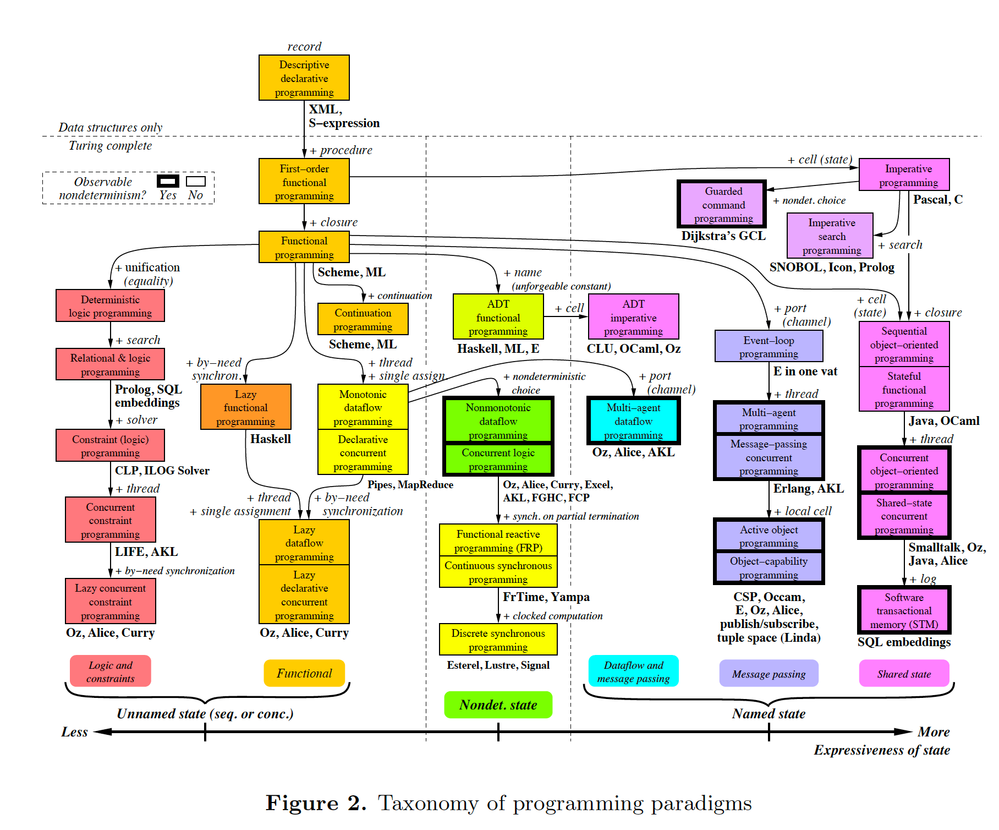

# Programming paradigm

A programming paradigm is the classifications of how codes are structured to solve problems.
There are two main categories, Imperitive and Declarative. Both these paradigms can achieve similar results and have a subtle difference. We will discuss below.

Programming paradigm aims at making code easier to write and understand by improving the clarity and readability of the program as well as building code that is more reusable with a possible decrease in side effects.

Many common programming languages today are multi-paradigm. These include Javascript, Java and Kotlin.


Creadits to [info.ucl.ac.be](https://www.info.ucl.ac.be/~pvr/VanRoyChapter.pdf)

## Imperative programming paradigm

An imperative programming paradigm is a code that structures as instructions to the machine. Step by step instructions is given to a subject to achieve a goal.

I.E.

1. Person A picks up a spoon
2. Person A scoop food
3. Person A put food to the mouth mouth

Examples of Imperative

- Procedural
- Object-oriented

### Advantages:

- Simple to write
- increase reusability

Example of Fortran

```
    PROGRAM Triangle
     IMPLICIT NONE
     REAL :: a, b, c, Area
     PRINT *, 'Welcome, please enter the&
              &lengths of the 3 sides.'
     READ *, a, b, c
     PRINT *, 'Triangle''s area:  ', Area(a,b,c)
    END PROGRAM Triangle
    FUNCTION Area(x,y,z)
     IMPLICIT NONE
     REAL :: Area            ! function type
     REAL, INTENT( IN ) :: x, y, z
     REAL :: theta, height
     theta = ACOS((x**2+y**2-z**2)/(2.0*x*y))
     height = x*SIN(theta); Area = 0.5*y*height
    END FUNCTION Area
```

Credits to [mrao.cam.ac.uk](http://www.mrao.cam.ac.uk/~pa/f90Notes/HTMLNotesnode40.html)

## Declarative

A declarative programming paradigm is a code that structures in a way that expresses what you want to achieve based on preconditions. Declarative separates the subject from the instructions.

Advantage:

- reduce unintended changes(side effect)
- predictable results
- scalability

Disadvantage:

- Can be hard to think about when chaining multiple functions

1. Given a person and a spoon on the table pick up the spoon
2. where a person holding the spoon and there is food on the table, scoop the food
3. for a person is holding a spoon with food, put the spoon into his mouth

Examples of declarative programming paradigm

- Functional Programming

Example of calculating the area of a triangle in Haskell

```
area_of_triangle :: Float -> Float -> Float -> Maybe Float
area_of_triangle x y z
  | x+y>=z && x+z>=y && y+z>=x = Just (sqrt(s*(s-x)*(s-x)*(s-x)))
  | otherwise = Nothing
  where
    s=(x+y+z)/2
```
